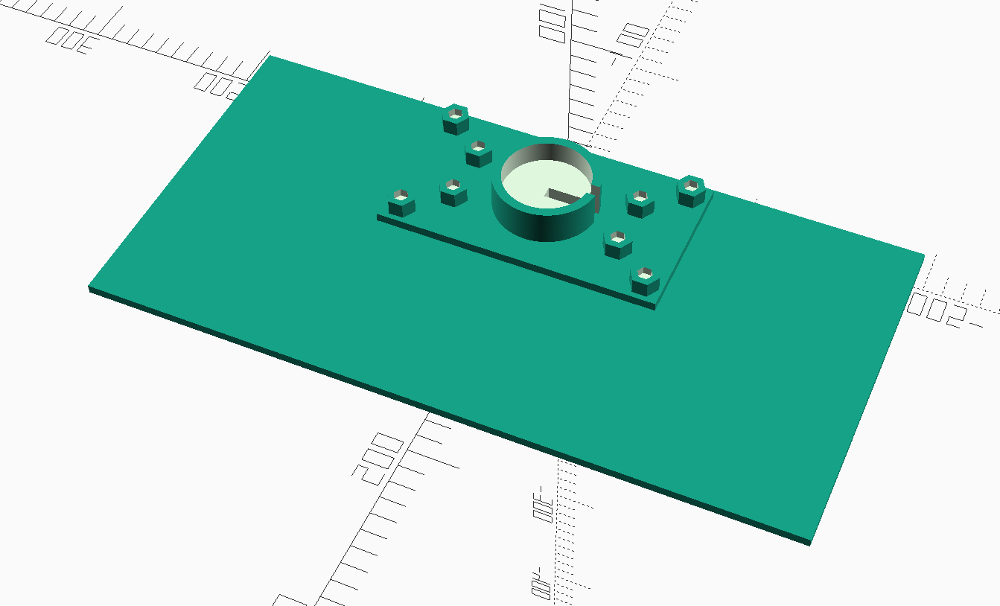

# Monitor stand-mounted shelf
This project aims to 3D-print a shelf that can sit behind my monitor stand.

It makes use of [rcoyler/threads-scad](https://github.com/rcolyer/threads-scad) to create four
bolts and a threading that goes through the mounting plate to the two shelf plates.

This is what the fully assembled model should look like:

